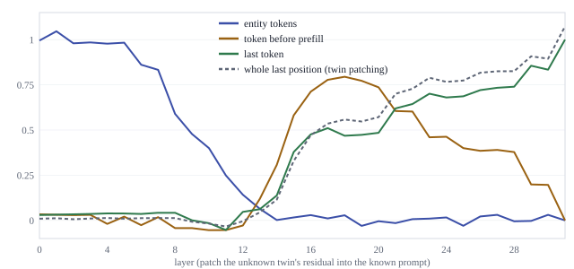
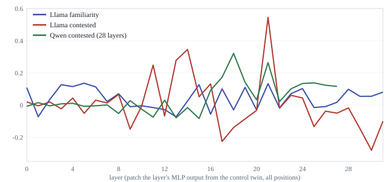

# No confidence neurons on the behavioral arm — and a faithfulness-tested uncertainty circuit

*Results summary for the `uncertainty-circuit-experiments` line of work. Full lab record and interactive report: the "Uncertainty Neurons Rebuilt" artifact; definitions and dataset standard: [UNCERTAINTY_DEFINITION.md](UNCERTAINTY_DEFINITION.md).*

## Abstract

Claims about uncertainty mechanisms in language models are only as good as the datasets that define "uncertain" and the counterfactuals that test them. We contribute a **model-relative gated-twin** standard: minimal prompt pairs kept only when the model itself proves the labels by sampled correctness, distributional spread, and (for behavioral arms) hedging, with keep rates reported and the deterministic grader audited against a 32B judge (agreement 94.6–100%, and *lower* disagreement on hedged answers). On this footing we re-examine "confidence neurons" in Llama-3.1-8B-Instruct and Qwen2.5-7B-Instruct: correlation-selected neurons decompose into token-frequency neurons and a general temperature neuron; on the behavioral (familiarity) arm no single neuron survives an uncertainty-specificity test, and the only robust single-neuron effects anywhere (two neurons, contested-source arm) pattern as answer-competition rather than knowledge awareness. The hedge decision itself is carried by a small patched set: the entity is read in the first eight layers, a verdict is routed mid-stack (L13–19 / L17–21) by verified attention heads, and joint patching of 20 heads + 100 MLP neurons transfers 78–107% of the held-out hedge readout between twins (random sets: 2–6%) in three of four model × arm cells, with partial cross-type overlap (Jaccard 0.11, head-recovery ρ = 0.61). We report what our own criteria could not decide: confidence intervals graze or cross the sparsity-faithfulness bar in two of three cells, recovery does not saturate with component count (a distributed-direction signature), and the entropy adjustment used to retire single-neuron claims is unidentified on gated arms. One asymmetry holds on the full table: in Llama, removing the unknown signal (patching the known state into the uncertain prompt) transfers the hedge decision with little of the entropy, while injecting it transfers both.

## Methods

**Datasets: uncertainty as a (model, prompt) property.** A twin pair is one manipulation with one change (obscure vs famous PopQA subject in the same relation template; two disagreeing sources vs one; many valid answers vs one), identical chat template and prefill, question length within 3 tokens. A pair enters an arm only if the model proves the labels: control answered correctly in ≥ 9/10 samples (greedy + 10 at T = 0.7, alias-graded), uncertain 0/10, entropy gap ≥ 0.5 nats, and — for the behavioral arm — hedging gap ≥ 0.3 over free generations. Keep rates are reported, never tuned (Llama familiarity 195/1151, contested 234/600, aleatoric 41/120; Qwen 24 / 178 / 39; situated dropped 3/600 with the reason on record). The alias grader is validated against a Qwen2.5-32B judge on a stratified sample (agreement 94.6–100%, κ 0.70–1.00); disagreement is *lower* on hedged answers (1.5% vs 6.1%), so grader error does not mimic the behavioral readout. `scripts/gate_twins.py`, `scripts/judge_audit.py`.

**Neuron-level causal battery.** Mean-ablation at the readout position with an explicit reference policy and matched control prompts; sign-flip permutation per cell; two-sided permutation for the uncertain-vs-control interaction; BH-FDR at 0.01; and a baseline-entropy adjustment (ANCOVA), because a flat distribution amplifies the *magnitude* of any perturbation (ρ(H, |shift|) = 0.25; the signed shift is uncorrelated, ρ ≈ 0, and on gated arms the adjustment is unidentified — see claim 2). Dose–response, frozen-RMSNorm decomposition, temperature-matched frequency tests, behavioral clamping and verbalized confidence complete the battery. `scripts/run_ablation.py`, `scripts/entropy_adjusted_interaction.py`, `scripts/frequency_causal.py`.

**Circuit-level decomposition.** All circuit claims rest on activation patching between gated twins — reference-free by construction. Pipeline: (1) position × layer map of residual patching (entity span / question tail / readout position); (2) attribution patching (activation difference × gradient of the hedge log-odds) over every head at every position, top 30 heads verified by real patching; (3) the same at MLP-block and single-neuron level in the routed window, top-N neuron sets verified jointly against size-matched random sets; (4) faithfulness: the final head + neuron set patched jointly on held-out pairs, both directions, against 10 random sets, with the criterion *recovery > 0.7 with < 2% of components* (fixed in the analysis code before the held-out runs; not independently registered); (5) the identical pipeline on a second arm and a second model, with component-set overlap. Readout: hedge-vs-answer log-odds and entropy at the prefilled position; recovery = (patched − target)/(source − target). `scripts/circuit_*.py`, `scripts/run_overnight.sh`.

## Claims and their status

| # | Claim | Evidence | Status |
|---|---|---|---|
| 1 | Correlation-selected "confidence neurons" are mostly token-frequency neurons plus a general temperature neuron; the taxonomy is causally verified with a temperature-matched baseline. | `results/frequency_causal_*`, `results/stolfo_*` | **Established** |
| 2 | No single neuron is uncertainty-specific on the original stimuli (overlapping entropy supports; three adjustment schemes agree) or on the behavioral (familiarity) arm; the two neurons that survive all specifications (L31_N11541, L30_N1457, contested arm only) pattern as answer-competition, not ignorance. Caveat: ρ(H, signed shift) ≈ 0 while ρ(H, abs shift) = 0.25, so the ANCOVA is unidentified on gated arms — the gated-arm nulls rest on the temperature-matched design and the behavioral nulls, not on the adjustment. | `results/*/entropy_adjusted.csv` | **Established with the identification caveat** |
| 3 | Uncertainty is model-relative: identical candidates give Llama 195 behavioral pairs and Qwen 24; contested and aleatoric arms dissociate distributional from behavioral uncertainty in both models. | `data/*/gate_report.json` | **Established** |
| 4 | The hedge decision is computed early (entity, L0–7), routed mid-stack (L13–19 / L17–21) by ~10 verified heads, and read out by mid-layer MLP neurons into the late-layer machinery of claim 1. | `results/circuit_*` (Figures 1–2) | **Established** in 3 of 3 runnable model × arm cells |
| 5 | ≈2% of heads + 0.02% of neurons transfer 78–107% of the held-out hedging readout; random sets 2–4%. 95% CIs: familiarity 0.80 [0.70, 0.89], Llama contested 0.89 [0.69, 1.09], Qwen 0.86 [0.77, 0.95] — the CI crosses the 0.7 criterion in Llama-contested and grazes it in familiarity, and neuron-set recovery does not saturate (0.23/0.43/0.52/0.65 at N=10/30/100/300). | `results/circuit_*/faithfulness*`, `direction_patch*`, `prune_*` (Figure 3) | **Established; minimality decided by follow-up**: LOO-ranked pruning saturates (20 components → 0.71 on familiarity, plateau 0.85–0.89; 40 → 0.91 on contested), and rank-1 direction patching falls short of the set for un-hedging (0.46 vs 0.80 familiarity; −0.10 vs 0.89 for removing the contested verdict; injecting the unknown projection works, u→c 0.97) — a sparse circuit with a directional sub-channel. |
| 6 | Types share machinery only partially: cross-arm Jaccard 0.11 (heads and neurons), head-recovery ρ = 0.61 — one variable, two readouts. | `results/circuit_conflict/faithfulness_summary.txt` | Supported (one model; two arms) |
| 7 | **Reframed (all cells reported):** in Llama the decision and the spread transfer *asymmetrically by intervention direction* — removing the unknown signal (c→u: the known state patched into the uncertain prompt) transfers the hedge log-odds with little entropy (−0.13 familiarity, +0.33 contested); injecting it (u→c) transfers both (+0.45, +0.55). Not a general dissociation: steering moves both together, and Qwen shows no asymmetry (+0.83/+0.73). | `results/circuit_*/faithfulness.csv`, all six cells | **Supported as a directional asymmetry (one model, two arms)** |

## Results in three figures

**Figure 1 — the verdict moves: entity → readout position (Llama familiarity).** Patching the unknown twin's residuals into the known prompt one position group at a time: entity tokens carry the full decision at L0–7 and nothing after L13; the pre-prefill token and the last position pick it up from L13–17.

**Figure 2 — the mid-stack MLP window, three runs.** Recovery when a single layer's MLP output is patched from the control twin: Llama contested peaks at L11–14 and L21, Qwen contested at L17–21; familiarity rides more on heads than on any single MLP block.

**Figure 3 — faithfulness: circuit vs random, held-out pairs.** 20 heads + 100 neurons recover 0.80 / 0.89 / 0.86 (Llama familiarity / Llama contested / Qwen contested; reverse direction 1.07 / 0.78 / 0.98) vs 0.02–0.06 for size-matched random sets. The pre-registered CIRCUIT verdict passes in both Llama runs; Qwen misses only the sparsity clause (20 heads = 2.55% of its 784 heads).

## Post-audit corrections (25 Aug 2026)

An external audit of this branch was verified against the result files and acted on: 95% CIs added to
every faithfulness cell; the "pre-registered" wording for the circuit criterion struck (thresholds for the
*gate* predate the gating; the circuit criterion was fixed in code before the held-out runs but not
independently registered); claim 7 reframed from a general dissociation to the direction-dependent
asymmetry the full table supports; the abstract's "no single neuron survives" scoped to the behavioral
arm; the bibliography rebuilt with verified author lists; and the closest prior work added — **SCIURus**
(Teplica, Liu, Cohan & Rudner, NAACL 2025 Long: shared uncertainty/factuality circuits across eight
models via causal tracing and zero-ablation). Relative to SCIURus this work adds the gated-twin data
standard, twin-based patching, random-set faithfulness controls, neuron granularity, and cross-type
overlap — and drops any claim of being the first uncertainty circuit. Also cited now: Du et al. (COLM
2025), Arora et al. (ICML 2026, MLP-only neuron-basis circuits), Zhao et al. (COLM 2026), Vazhentsev et
al. (ICML 2026), Singha Roy et al., Basu et al. Independent novelty assessment: 7/10 — high
combinatorial/methodological novelty, near-ideal fit for InterpScience ("rigor as the contribution").
Deadline: extended to **Sept 1, 2026 AoE** (short ≤ 5 pp, long ≤ 9 pp).

**Final evidence round (25 Aug, night):** the random-neuron-null test (100/50 controls on the same prompts) replaced the ANCOVA: four familiarity candidates exceed all controls at ≤ 0.013 nats (≈0.5% of the twins' 2.8-nat entropy gap; largest L29_N5866, z = −6.2), and the contested pair reaches z = +29.4 / +14.8 — single neurons register, two orders below the circuit's transfer (`results/gated_specificity_summary.txt`). Qwen rank-1 replicates direction-as-spread (0.46 vs set 0.86; entropy 0.84). A prefitted Jacobian lens (neuronpedia/jacobian-lens) reproduces the routing windows observationally — familiarity log-odds gap flat to L12, 50% by L16, while the entropy gap reaches 50% only at L28 — and the decoded direction's top tokens become ' unknown' / ' I' at L15–16 (`results/circuit_*/jlens_*`, Figure 4: `figures/fig4.svg`).

**Spotlight round (25 Aug, late):** the pre-stated aleatoric prediction (spread without decision) held cleanly in Llama (final lens log-odds gap +0.30 vs +5.05/+4.75 on the decision arms; entropy +1.0) and partially in Qwen (+3.67, ≈44% of its contested gap, emerging only at L25–26 — reported as found). The **verbalization moment** is localized: median lens rank of ' unknown' at the uncertain readout falls 1,098 (L13) → 10 (L17) → single digits, while both entity spans and the control readout stay in the thousands (Figure 5, `figures/fig5.svg`). Steering the direction at L15 on *known* twins gives a monotonic dose–response of that rank (α ± 3σ); Qwen shows the same mechanism on its own hedge word (' not' at L24: 95k → 1.2k under +3σ). **Five-cell vocabulary result** (`results/circuit_*/jlens_direction_tokens.txt`): each arm's decoded direction speaks its own vocabulary — familiarity: a full hedge lexicon from L17 (' unknown', ' cannot', ' unable', ' unsure'); contested: the conflict itself, ' both'/' either' (L11–15) → ' conflicting'/' contradictory' (L16–20) → ' ambiguous'/' inconsistent' (L21–25), with ' unknown'/' I' never appearing (' unclear' enters late, L21–24); aleatoric: the answer type, ' example' (L14–20) → ' any' (L21–25), never hedge words. Both the conflict and the 'any' vocabularies replicate in Qwen at L20–24, partly in Chinese (任意, 不同, 分歧); Qwen's mid-stack decodings are noise. Qwen pruning completes the minimality table: 10 components reach 0.7 (plateau 1.03–1.14). Files: `results/circuit_{aleatoric,aleatoric_qwen}/jlens_*`, `results/circuit_familiarity/jlens_{steer,entity,demo}*`, `results/circuit_conflict_qwen/jlens_*`, Qwen `prune_*`.

**Decider follow-ups (25 Aug, evening):** rank-1 direction patching and LOO pruning resolved the sparse-vs-distributed question (claim 5 above), and dissected claim 7 mechanistically: the mean-difference direction is a *spread* channel in the removal direction (removing it on contested — swapping in the control projection — moves entropy 0.57, log-odds −0.10; injecting it does switch the hedge on, u→c 0.97), while the component set carries the *decision* in both directions (log-odds 0.89, entropy 0.33). 30-random-set nulls match the 10-set ones (0.018 ± 0.022, 0.040 ± 0.044). Files: `results/circuit_*/direction_patch*`, `prune_*`, `faithfulness*`.

## Provenance

Every result file carries a `.provenance.json` sibling (model id, precision, library versions, data hashes, seeds, parameters). Judge audits: `results/judge_audit_*`; Qwen mirrors under `results/second_model/qwen25_7b_instruct/`. Reproduction: `scripts/run_all.sh` (neuron battery), `scripts/run_overnight.sh` (judge + circuits).
